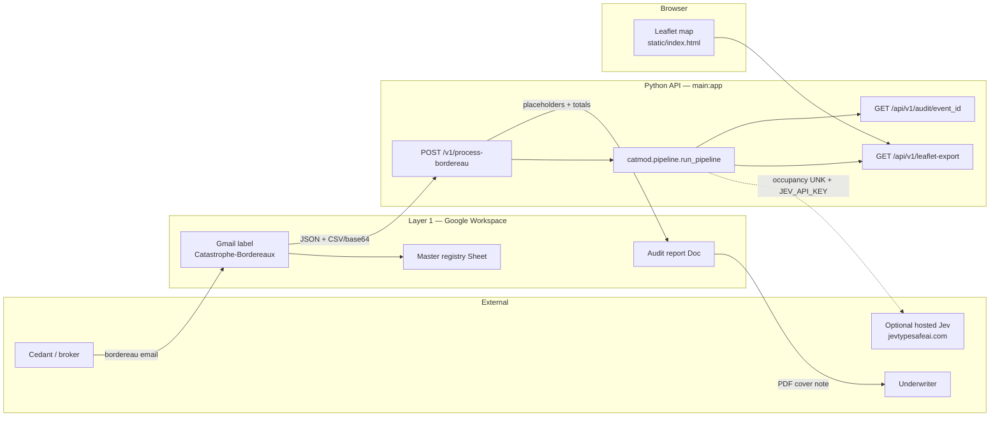
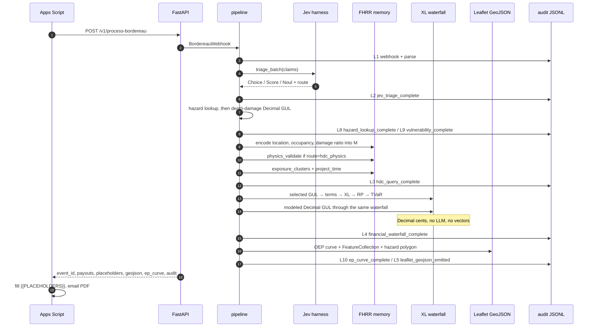
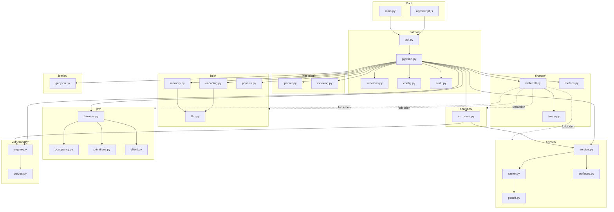
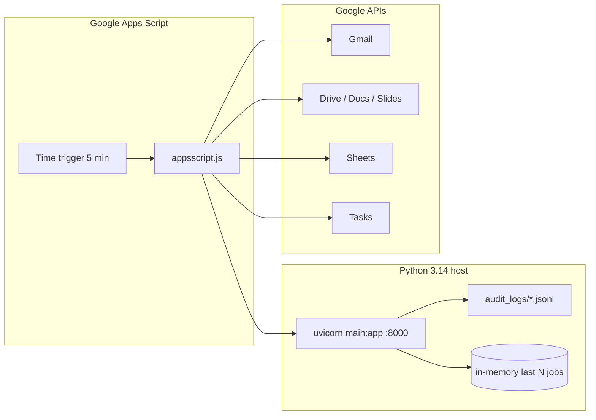

# Hypervector RAG — Full Architecture

Catastrophe modeling and reinsurance portfolio analytics. The system ingests messy cedant/broker bordereaux through Google Workspace, triages each line with a sub-second System-One harness (Jev), looks up flood depth, converts that depth to a damage ratio and a cents-rounded ground-up loss, stores the event footprint in a single FHRR hypervector, calculates Excess-of-Loss payouts with deterministic actuarial math, and emits an exceedance-probability curve, Leaflet GeoJSON, and an executive audit report.

**Rule of isolation:** Layers 2 and 3 may classify and interpolate. Hazard severity and damage ratios are physical. Layer 4 money is `Decimal` cents (`ROUND_HALF_EVEN`) and is never approximated by a model or a vector. Bundled flood grids and proxy damage curves are tagged `synthetic: true`.

---

## 1. What the system does

| Step | Layer | Input | Output |
|------|-------|--------|--------|
| 1 | Google Workspace | Gmail `.csv` / `.xlsx` / `.pdf` | Client Index ID, Sheet row, webhook POST |
| 2 | Jev System-One | Raw bordereau lines | Occupancy Choice, fraud Noul, spatial Score, route |
| 2b | Hazard | Latitude, longitude, return period | Flood depth (m) or susceptibility, anomaly flags |
| 2c | Vulnerability | Occupancy code, depth, TIV | Damage ratio in `[0, 1]`, ground-up loss in Decimal cents |
| 3 | HDC / FHRR | Location, occupancy, damage ratio | Superposition memory `M`, interpolation, clusters, `M(t+Δt)` |
| 4 | Finance | Selected GUL, deductibles, limits, treaty | Cedant net, reinsurer paid, reinstatement, TVaR/PML |
| 5 | Leaflet + EP + Docs | Enriched claims, scenario catalog | GeoJSON, OEP curve, Google Doc PDF email |

```text
Exposure → hazard depth → damage ratio → TIV × DR → ground-up loss (Decimal cents)
        → deductible → limit → XL layer → reinstatement
        → FHRR memory update and EP / Leaflet export
```

Sample job on `data/sample_bordereau.csv` (7 Miami locations, default `$100M xs $40M` at 90% share, `loss_basis=auto`):

- Gross claim after primary terms: **$139,045,000** (reported bordereau losses)
- Reinsurer payout: **$89,140,500**
- Cedant retention: **$49,904,500**
- Reinstatement premium due: **$4,952,250**
- Fraud flags: **1** (null-island `A-005`, audited as `NULL_ISLAND`)
- Synthetic 100-year modeled ground-up: **$131,807,594.50**
- Synthetic catalog EAL: **$30,964,904.88**
- Jev batch latency: **~1 ms** (budget 500 ms)
- Full pipeline: **~320 ms** (budget 1000 ms)

---

## 2. System context



---

## 3. Runtime sequence



---

## 4. Separation of duties

```mermaid
flowchart TB
  subgraph L2["Layer 2 — Jev  (semantic, fast, non-authoritative for money)"]
    Occ[Occupancy Choice]
    Fraud[Fraud Noul]
    Sev[Spatial Score]
    Route{confidence > 0.95<br/>and clean?}
    Occ --> Route
    Fraud --> Route
    Sev --> Route
  end

  subgraph PhysModel["Hazard + vulnerability  (physical, Decimal at the money boundary)"]
    Haz[Depth or susceptibility]
    DR["DR in 0..1"]
    MGUL["GUL = TIV × DR, cents"]
    Haz --> DR --> MGUL
  end

  subgraph L3["Layer 3 — HDC  (spatial memory, not contractual)"]
    Enc["H includes location, occupancy, DR"]
    Mem[M = Σ H_i]
    Phys[Interpolation + physics flag]
    Enc --> Mem --> Phys
  end

  subgraph L4["Layer 4 — Finance  (sole source of payout)"]
    GUL[min(GUL, limit) − deductible]
    Coin[× coinsurance]
    XL["layer = min(max(gross − attach, 0), limit)"]
    Share[× coparticipation]
    RP["RP = min(exhaustion, reinstatements) × rate × premium"]
    GUL --> Coin --> XL --> Share --> RP
  end

  Occ --> Haz
  Route -->|finance| L4
  Route -->|hdc_physics| L3
  MGUL -->|loss_basis modeled, or reported GUL is 0| GUL
  L3 -->|flag / interpolation score only| L4
  L4 -->|covered + allocated XL| L5[Layer 5 GeoJSON + EP curve]
```

HDC interpolation **never** overwrites `ground_up_loss`, `reinsurer_payout`, or `cedant_retained_loss`. Those fields come only from `catmod/finance/`. When `loss_basis` is `auto` (the default) or `reported`, a positive bordereau ground-up loss stays the contractual input. `loss_basis=modeled`, or a zero reported ground-up loss, sends the vulnerability module's `Decimal` cents into that same waterfall. The modeled waterfall always runs beside it and is audited as `modeled_vulnerability_waterfall`.

---

## 5. File and module map

```text
Hypervector RAG/
├── main.py                      FastAPI entry; re-exports FHRR + XL + GeoJSON
├── appsscript.js                Layer 1 Gmail / Sheets / Docs / Gmail PDF
├── appsscript.json              OAuth scopes
├── requirements.txt
├── pytest.ini
├── .env.example
├── ARCHITECTURE.md              this file
├── README.md
├── FULL_CODEBASE.txt            concatenated source dump
├── catmod/
│   ├── api.py                   HTTP surface
│   ├── pipeline.py              job orchestrator
│   ├── schemas.py               Pydantic contracts
│   ├── config.py                env settings
│   ├── audit.py                 JSONL layer verification
│   ├── ingestion/               parse CSV / XLSX / PDF + IDs
│   ├── jev/                     Choice / Score / Noul harness
│   ├── hazard/                  raster, GeoTIFF, synthetic atlases
│   ├── vulnerability/           depth-damage curves, Decimal GUL
│   ├── analytics/               OEP curve, EAL, TVaR, PML
│   ├── hdc/                     FHRR algebra, memory, physics
│   ├── finance/                 treaty, waterfall, empirical TVaR/PML
│   ├── leaflet/                 GeoJSON + style
│   ├── flood/                   map sidecar (geocode, vision, footprints)
│   ├── geo/                     open-stack fallbacks
│   └── spatial/                 elevation, 3D Tiles, Blender
├── data/sample_bordereau.csv
├── data/flood_hazard/           sample surge polygon
├── templates/reinsurance_audit_report.txt
├── static/index.html            Leaflet consumer
├── scripts/run_sample_job.py
├── tests/
└── audit_logs/                  per-event JSONL
```



---

## 6. HTTP and Google contracts

| Method | Path | Role |
|--------|------|------|
| GET | `/health` | Liveness |
| POST | `/v1/process-bordereau` | Apps Script / CLI webhook |
| GET | `/api/v1/leaflet-export?event_id=` | GeoJSON for the map |
| GET | `/api/v1/audit/{event_id}` | Layer verification |
| GET | `/api/v1/events` | In-memory job index |
| GET | `/map/` | Static Leaflet UI |

Webhook body (`BordereauWebhook`): `client_email`, `filename`, `data` (CSV text) or `data_base64` (xlsx/pdf), optional `treaty`, `hazard_polygon`, `client_index_id`, `source_urls` (Drive or document links taken from the email body). Catastrophe-model fields: `loss_basis` (`auto` | `reported` | `modeled`), `return_period` (10, 25, 50, 100, 250, 500; default 100), `hazard_region` (`miami`, `nairobi`, `nzoia`), `hazard_raster_path` (CSV, ESRI ASCII `.asc`, or uncompressed GeoTIFF).

Job JSON adds `modeled_ground_up_loss`, `modeled_waterfall`, `ep_curve`, `treaty` (`attachment_point`, `limit`, `label`), `source_urls`, and a `synthetic` object. Leaflet metadata carries `synthetic: true` and the same EP curve.

Report placeholders filled by Apps Script:

`{{CLIENT_NAME}}` `{{EVENT_ID}}` `{{GROUND_UP_LOSS}}` `{{REINSURER_PAYOUT}}` `{{CEDANT_RETENTION}}` `{{FRAUD_FLAG_COUNT}}` `{{MODELED_GROUND_UP_LOSS}}` `{{EXPECTED_ANNUAL_LOSS}}` `{{SYNTHETIC}}`

---

## 7. Layer internals

### Layer 2 — Jev primitives

Evaluated in one non-autoregressive pass per line:

| Primitive | Question | Meaning |
|-----------|----------|---------|
| Choice | `occupancy` | HAZUS-like code (`COM_WHSE`, `RES_SF`, …) |
| Noul | `fraud_or_discrepancy` | P(yes) in `[0, 1]` |
| Noul | `clean_for_finance` | May skip extra physics |
| Score | `spatial_severity` | 0 = consistent … 4 = physically impossible |

Routing: occupancy confidence **and** clean Noul **> 0.95** and no spatial flag → `finance`; else → `hdc_physics`. Local lexicon handles `whse`, `steel-shed`, `storage`, and informal sheet housing (`mabati`, `iron sheet` → `informal_iron_sheet`). Hosted Jev is optional (`JEV_API_KEY`). The standardized occupancy code is the vulnerability curve key.

### Hazard lookup

`catmod/hazard/` samples a north-up grid (bilinear) or a nearest coordinate index.

- Bundled synthetic atlases: Miami surge depth, Nairobi susceptibility, Nzoia basin susceptibility. Susceptibility in `[0, 1]` becomes an equivalent depth of `score × 6 m`, then clipped to `[0, 10] m`.
- Return-period scales on the stored 100-year field: 10 → 0.35, 25 → 0.55, 50 → 0.78, 100 → 1, 250 → 1.28, 500 → 1.55.
- `(0, 0)` is `NULL_ISLAND` (“Null Island”) before any raster test. Coordinates outside the selected surface are `IS_OUT_OF_BOUNDS`. Both are JSONL audit rows on layer 8.
- Loaders: `load_hazard_file` for `.csv`, `.asc`, and classic uncompressed GeoTIFF (ModelPixelScale + ModelTiepoint). No GDAL dependency.

### Vulnerability

`catmod/vulnerability/` maps the Jev code onto a proxy depth-damage curve shaped like the JRC / Huizinga flood functions. The bundled knots are a proxy, so every result has `synthetic: true` and `curve_family: jrc_huizinga_proxy`.

Linear interpolation on `Decimal` knots stays inside `[0, 1]`. Ground-up loss is `TIV × damage ratio`, quantized to cents with `ROUND_HALF_EVEN`, and that `Decimal` is what Layer 4 receives on the modeled path.

### Exceedance probability

`catmod/analytics/ep_curve.py` sums modeled ground-up loss at each catalog return period. Exceedance probability is `1 / RP`, so it is strictly decreasing in the return period. Scenario losses must be non-decreasing in the return period.

- EAL is the trapezoid of loss versus exceedance probability, with loss 0 at probability 1 and a flat tail from the rarest scenario down to probability 0.
- PML at a return period is the scenario loss (interpolated in exceedance space when the period is not a catalog knot).
- TVaR at α is the mean of the piecewise-linear quantile from α to 1.
- The curve is embedded in the job payload and in Leaflet `metadata.ep_curve`, and audited on layer 10.

### Layer 3 — FHRR

- Representation: unit-modulus complex vectors, **D = 10,000**
- Bind `⊗`: Hadamard product (phase addition)
- Bundle `⊕`: superposition sum
- Continuous scalar: `H = B^x` (coarse globe scale + ~2 km fine scale for lat/lon)
- Portfolio: `M = Σ H_claim_i`
- Each claim binds location, occupancy, and the physical damage ratio into that one vector
- Time: `M(t+Δt) = M(t) ⊗ P^{Δt}`
- Query: unbind / similarity — no vector database
- The decoded vector never replaces a treaty payout

### Layer 4 — Waterfall

1. Covered = `max(0, min(GUL, limit) − deductible) × coinsurance`
2. Gross = sum of covered (occurrence)
3. Layer loss = `min(max(gross − attachment, 0), limit)`
4. Reinsurer = layer × coparticipation (default 0.90)
5. Cedant = gross − reinsurer
6. Reinstatement = `min(layer/limit, reinstatements) × rate × original_premium`
7. TVaR / PML from the empirical covered sample (`catmod/finance/metrics.py`)

Money uses `Decimal` quantized to cents, `ROUND_HALF_EVEN`. `catmod/finance/waterfall.py` accepts the vulnerability module's `Decimal` ground-up loss directly. A second call, `modeled_vulnerability_waterfall`, always prices `TIV × DR` on the same treaty terms and is marked `synthetic: true`.

`loss_basis`:

| Value | Primary ground-up loss |
|-------|------------------------|
| `auto` (default) | Reported value when it is positive; otherwise the modeled cents |
| `reported` | Bordereau ground-up loss |
| `modeled` | Vulnerability `Decimal` cents |

### Audit layers

| Layer | Name | Successful step the verifier requires |
|-------|------|----------------------------------------|
| 1 | `google_workspace_ingestion` | `apps_script_webhook_received`, `bordereau_parsed`, or `job_opened` |
| 2 | `jev_system_one` | `jev_triage_complete` |
| 3 | `hdc_fhrr_spatial_memory` | `hdc_portfolio_encoded` or `hdc_query_complete` |
| 4 | `deterministic_reinsurance_finance` | `financial_waterfall_complete` |
| 5 | `leaflet_geojson_export` | `leaflet_geojson_emitted` |
| 8 | `hazard_raster_lookup` | `hazard_lookup_complete` (anomalies use status `NULL_ISLAND` or `IS_OUT_OF_BOUNDS`) |
| 9 | `vulnerability_damage_function` | `vulnerability_complete` |
| 10 | `exceedance_probability_analytics` | `ep_curve_complete` |

Layers 6 and 7 remain the flood sidecar and the 3D export. The verifier still requires layers 1–5. Layers 8–10 are written on every bordereau job.

### Layer 5 — Map style

| Color | Meaning |
|-------|---------|
| `#2A9D4A` | Low retained loss |
| `#E07A3D` | Material cedant retention |
| `#C1121F` | Reinsured XL allocation |
| `#7B1E3A` | Fraud / spatial flag |

---

## 8. Deployment view



Script properties (Apps Script project settings):

| Property | Purpose |
|----------|---------|
| `BACKEND_URL` | FastAPI origin, for example `https://your-api.example.com` |
| `REGISTRY_SHEET_ID` | Master registry spreadsheet id |
| `REPORT_TEMPLATE_ID` | Google Doc template id |
| `SLIDES_TEMPLATE_ID` | Slides template id, or blank to auto-build the four-slide deck |
| `DRIVE_FOLDER_ID` | Parent folder. Jobs land in `Catastrophe_Archive/YYYY-MM/Client/Event` |
| `TASKS_LIST_ID` | Tasks list id. Blank uses `@default` |
| `UNDERWRITER_EMAIL` | Fallback recipient when the message has no Reply-To |

Gmail label `Catastrophe-Bordereaux`, 5-minute trigger on `processIncomingBordereaux`. Editor checks: `testTasksIntegration`, `testDriveArchiving`, `testSlidesGeneration`. Manifest: `appsscript.json`.

---

## 9. How to run

```bash
pip install -r requirements.txt
python scripts/run_sample_job.py
python -m pytest tests -q
uvicorn main:app --port 8000
```

Then open `/map/` after posting a bordereau, or `GET /api/v1/leaflet-export`.

Full verbatim source of every project file: [`FULL_CODEBASE.txt`](FULL_CODEBASE.txt).
